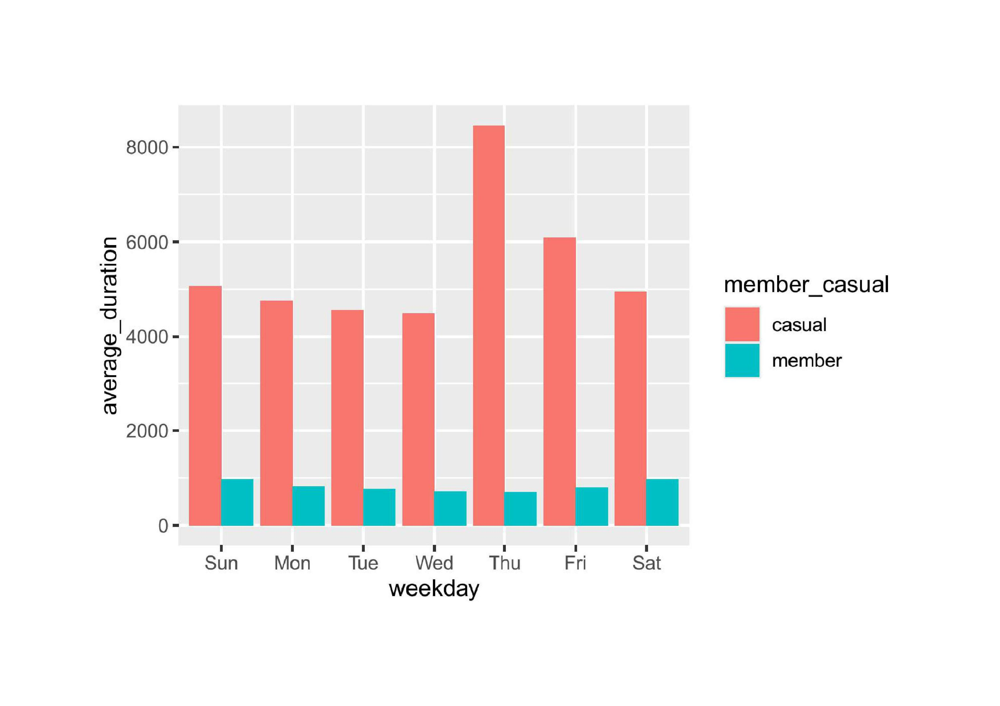
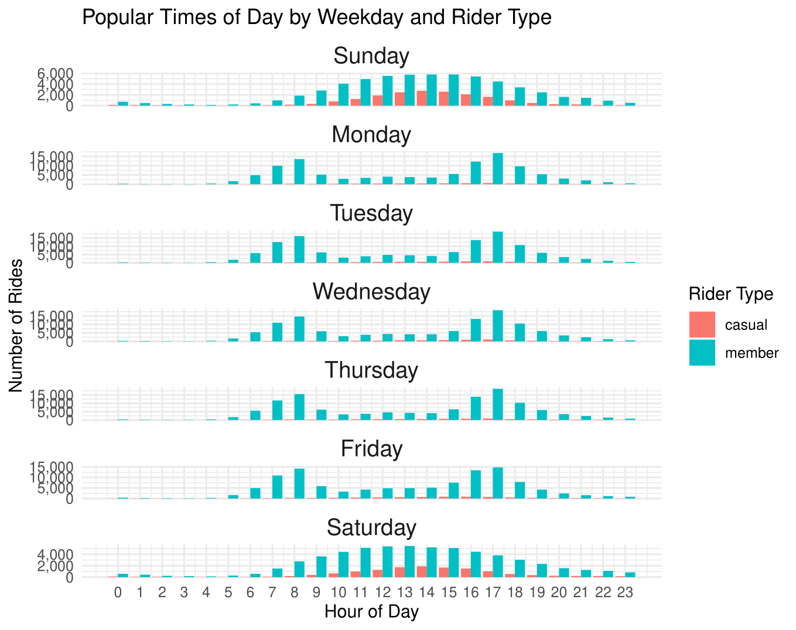
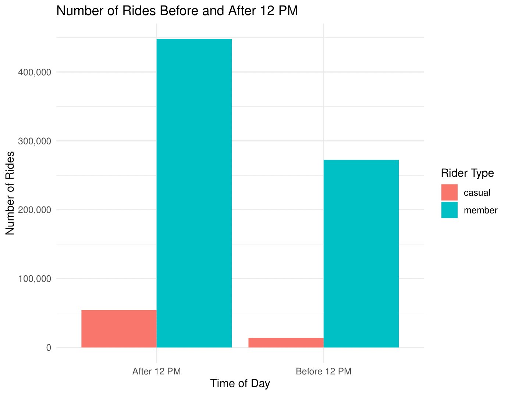
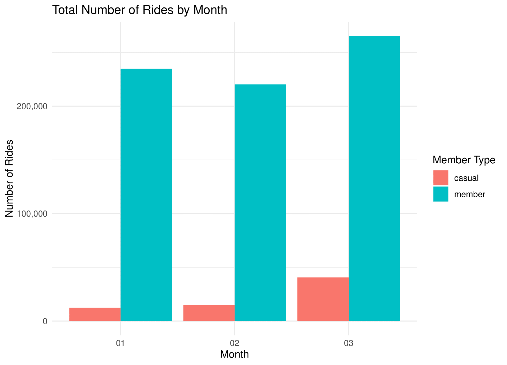

# Cyclistic Analysis

Welcome to my Cyclistic Analysis project! 

This project is about analyzing Cyclistic bike-share data to uncover trends and user behaviors. This project also describes targeted marketing to convert casual riders into annual members. Below, you'll find details about the project and how everything is organized.

## Project Overview
- **Objective**: Analyze Cyclistic bike-share data to identify trends and user patterns for Member riders versus Casual riders to create marketing strategies.
- **Key Deliverables**:
  - Insights into user behaviors
  - Visualizations of trends
  - Recommendations for improvements

## Repository Structure
```
Cyclistic Analysis/
├── README.md            
├── visualizations/      
    ├──Average_durationPlot.jpg 
    ├──NumberofRides-1.png
    ├──NumberofRidesbyMoRiderbyYear-1.png
    ├──PopularDaysforRidersJanuary-1.png
    ├──MostPopularDaysforRidersinFebruary.jpg
    ├──MostPopularDaysforRidersinMarch-1.png
    ├──PopularTimesofDaybyWeekdayandRiderType-1.png
    ├──RidesbyWeekdaandTimeofDay.png
    ├──RidesBeforeandAfter12PM-1.png
    ├──TotalRidesbyMonth-1.png


## Tools and Technologies
- **R Programming**: tidyverse, conflicted, dplyr, lubridate, readr, ggplot2, leaflet, stringr
- **Data Visualization**: Charts and graphs
- **GitHub**: Version control and collaboration
- **Data Source**: Historical trip data from January 2019 to December 2020 quarter one, to analyse trends.
- **Data Description**: Includes variables such as: date, time, bike type, station names for beginning and end of trips, as well as limited voluntary information such as birthdate and gender.
- **Data Downloads**: [Divvy Trip Data](https://divvy-tripdata.s3.amazonaws.com/index.html), [Divvy 2019 Q1
](https://docs.google.com/spreadsheets/d/1uCTsHlZLm4L7-ueaSLwDg0ut3BP_V4mKDo2IMpaXrk4/template/preview?resourcekey=0-dQAUjAu2UUCsLEQQt20PDA#gid=1797029090), [Divvy 2020 Q1](https://docs.google.com/spreadsheets/d/179QVLO_yu5BJEKFVZShsKag74ZaUYIF6FevLYzs3hRc/template/preview#gid=640449855)

## Findings
Here are key insights from the analysis:
1. **Peak Useage**: Most trips occurred during weekedays between 7am and 9am, coinciding with expected commuting hours for Members. Weekends for Casual riders.
2. **User Trends**: Casual riders as noted in backgroound, prefer weekends, while members use bikes for weekday travel.
Ride Duration stays relatively steady for members, and picks up at weeks end through the weekend for casual riders. Patterns of use are similar through January and February and increase in March, with casual ridership nearly doubling. Across all months weekend ridership is very popular within the mid morning to late afternoon hours. Through all weedkays rides trend up after 12pm. Without using personal demographics, further analysis needed to determine targeted advertisements like ride hotspots, which could determine if numbers generated are tourist heavy or local frequented areas.  

## Recommendations
1. Pricing structure revisit to determine how this could be incentivized for membership
2. Additional hotspot analysis for pinpoint targeted ads
3. incentive heavy advertising on peak hours and days for casual ridership.

## Visualizations
Here are some of the visualizations from my analysis showing the trends noted above:


*Figure 1: Shows the total average ride duration for all riders by weekday


*Figure 2: The total number of rides by weekday and by rider type


#Figure 3: Shows first quarter of 2019 and 2020 total rides for both rider types


*Figure 4: Popular days in January


*Figure 5: Popular days in February


*Figure 6: Popular days in March


*Figure 7: Popular Times of day showing peaks in ridership


*Figure 8: Depicts increase in number of rides after 12pm


*Figure 9: Differentiation of total rides by Members Casual Riders by 12pm


*Figure 10: Shows ridership totals in the first quarter by month

## Getting Started
1. Clone the repository:
   ```bash
   git clone https://github.com/JoaStef/Cyclistic-Analysis.git
   ```
2. Navigate into the repository folder:
   ```bash
   cd Cyclistic-Analysis
   ```
3. Explore the files and start analyzing!

## Acknowledgments
This project uses Cyclistic bike-share historical data for analysis under Motivate International Inc. under license [Data License Agreement| Divvy](https://divvybikes.com/data-license-agreement) and analysis is using basic available tools available 
for download and from web-based products.
